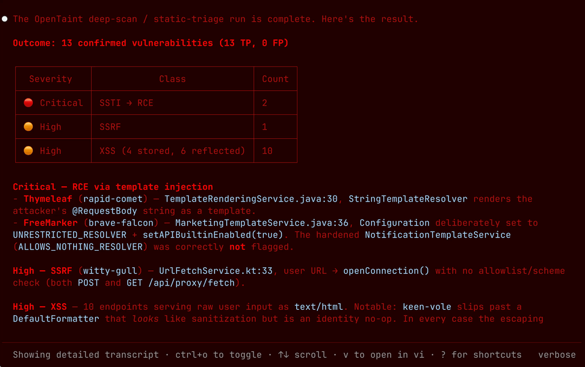

<p align="center">
  <picture>
    <source media="(prefers-color-scheme: dark)" srcset="../../logos/opentaint-logo-dark.svg">
    <source media="(prefers-color-scheme: light)" srcset="../../logos/opentaint-logo-light.svg">
    
  </picture>
</p>

<h3 align="center">AI 時代のオープンソーステイント解析エンジン</h3>

<p align="center">
  アプリケーションセキュリティのための形式的なテイント解析——AST パターンマッチングエンジンが見逃すものを発見し、LLM エージェントが脆弱性をルールとして適用できるようにし、どちらも単独では対応できない規模に拡張します。
</p>

<p align="center">
  <a href="https://github.com/seqra/opentaint/releases"></a>
  <a href="https://goreportcard.com/report/github.com/seqra/opentaint/cli"></a>
  <a href="../../LICENSE.md"></a>
  <a href="https://golang.org/"></a>
  <a href="https://discord.gg/6BXDfbP4p9"></a>
</p>

<p align="center">
  <a href="../../README.md">English</a> | <a href="README.zh.md">简体中文</a> | <a href="README.zht.md">繁體中文</a> | <a href="README.ko.md">한국어</a> | <a href="README.de.md">Deutsch</a> | <a href="README.es.md">Español</a> | <a href="README.fr.md">Français</a> | <a href="README.it.md">Italiano</a> | <a href="README.da.md">Dansk</a> | <a href="README.ja.md">日本語</a> | <a href="README.pl.md">Polski</a> | <a href="README.ru.md">Русский</a> | <a href="README.bs.md">Bosanski</a> | <a href="README.ar.md">العربية</a> | <a href="README.no.md">Norsk</a> | <a href="README.br.md">Português (Brasil)</a> | <a href="README.th.md">ไทย</a> | <a href="README.tr.md">Türkçe</a> | <a href="README.ua.md">Українська</a> | <a href="README.bn.md">বাংলা</a> | <a href="README.gr.md">Ελληνικά</a> | <a href="README.vi.md">Tiếng Việt</a>
</p>

<p align="center">
<a href="http://opentaint.org/">
<a href="http://opentaint.org/">
<picture>
  <source media="(prefers-color-scheme: dark)" srcset="../../public/opentaint-demo-light.gif">
  <source media="(prefers-color-scheme: light)" srcset="../../public/opentaint-demo-dark.gif">
  
</picture>
</a>
</a>
</p>

<p align="center"><b>対応技術とインテグレーション</b></p>
<p align="center">
  &nbsp;&nbsp;&nbsp;&nbsp;
  &nbsp;&nbsp;&nbsp;&nbsp;
  &nbsp;&nbsp;&nbsp;&nbsp;
  <picture>
    <source media="(prefers-color-scheme: dark)" srcset="../../logos/github-logo-dark.svg">
    <source media="(prefers-color-scheme: light)" srcset="../../logos/github-logo-light.svg">
    
  </picture>&nbsp;&nbsp;&nbsp;&nbsp;
  
</p>

<p align="center"><i>Spring アプリケーション向けの最も徹底的なテイント分析エンジン</i></p>

<p align="center"><b>ロードマップ</b></p>
<p align="center">
  &nbsp;&nbsp;&nbsp;&nbsp;
  &nbsp;&nbsp;&nbsp;&nbsp;
  &nbsp;&nbsp;&nbsp;&nbsp;
  &nbsp;&nbsp;&nbsp;&nbsp;
  
</p>

<div align="center">
<details>
  <summary><b>その他のスクリーンショット</b></summary>
  <p align="center">
    <picture>
      <source media="(prefers-color-scheme: dark)" srcset="../../public/opentaint-frame-light-1.png">
      <source media="(prefers-color-scheme: light)" srcset="../../public/opentaint-frame-dark-1.png">
      
    </picture>
  </p>
  <p align="center">
    <picture>
      <source media="(prefers-color-scheme: dark)" srcset="../../public/opentaint-frame-light-2.png">
      <source media="(prefers-color-scheme: light)" srcset="../../public/opentaint-frame-dark-2.png">
      
    </picture>
  </p>
  <p align="center">
    <picture>
      <source media="(prefers-color-scheme: dark)" srcset="../../public/opentaint-frame-light-3.png">
      <source media="(prefers-color-scheme: light)" srcset="../../public/opentaint-frame-dark-3.png">
      
    </picture>
  </p>
  <p align="center">
    <picture>
      <source media="(prefers-color-scheme: dark)" srcset="../../public/opentaint-frame-light-4.png">
      <source media="(prefers-color-scheme: light)" srcset="../../public/opentaint-frame-dark-4.png">
      
    </picture>
  </p>
  <p align="center">
    <picture>
      <source media="(prefers-color-scheme: dark)" srcset="../../public/opentaint-frame-light-5.png">
      <source media="(prefers-color-scheme: light)" srcset="../../public/opentaint-frame-dark-5.png">
      
    </picture>
  </p>
</details>
</div>

---

## なぜ OpenTaint なのか？

> OpenTaint は *Semgrep Pro* や *CodeQL* のオープンソース代替であり、カスタマイズしてセルフホストできる形式的な手続き間テイント解析エンジンです。AI エージェントがスキャンごとにトークンを消費することなく、セキュリティ解析を駆動できるよう設計されています。

AI はセキュリティチームが追いつけないほどの速さで本番コードを生成しており、その誤りを捉えるために作られた 2 種類のツールは、いずれも好ましくないトレードオフを強いてきました：

- **AST パターンマッチャー**（Semgrep OSS、ast-grep、各種リンター）は無料で高速ですが、データフローではなく構文を照合するため、関数境界や永続化層をまたぐ信頼できない入力はそのまますり抜けてしまいます。それを実際に捉えるより深い手続き間解析は、長らくプロプライエタリなツールの中に閉じ込められてきました。
- **LLM セキュリティエージェント**はパターンマッチャーが見逃すものを発見しますが、実行のたびにコードを読み直します。トークンはファイルごと、コミットごと、CI ビルドごとに積み重なり——それでも確率的なモデルは、すべてを捉えたと保証することはできません。

OpenTaint は、静的解析ツールのコストで LLM エージェントの深さを提供します：

- **AST パターンマッチャーが見逃すものを発見。** 形式的な手続き間データフローエンジンが、関数境界、永続化層、エイリアス、非同期コードを横断して信頼できないデータを追跡します。
- **スキャンごとではなく、モデルには一度だけ支払う。** エージェントに単一の検出結果をテイントルールへと蒸留させます。決定的なエンジンはそのルールをコードベース全体——そしてその後のすべてのコミット——に対して、数分の CPU 時間で、トークンコストゼロで再生します。
- **オープンソース、すぐに使える。** エンジン、ルール、CI インテグレーションが、Apache 2.0 と MIT ライセンスの下で一つのスタックとして提供されます。

## クイックスタート

**インストールスクリプト (Linux/macOS)**
```
curl -fsSL https://opentaint.org/install.sh | bash
```

**Homebrew でインストール (Linux/macOS)：**
```bash
brew install --cask seqra/tap/opentaint
```

**インストールスクリプト (Windows PowerShell)**
```
irm https://opentaint.org/install.ps1 | iex
```

**npm でインストール (Linux/macOS/Windows)：**
```bash
npm install -g @seqra/opentaint
```

**または npx で即座に実行——インストール不要 (Node.js が必要)：**
```bash
npx @seqra/opentaint scan
```

**プロジェクトをスキャン：**
```bash
opentaint scan
```

**または Docker を使用：**
```bash
docker run --rm -v $(pwd):/project -v $(pwd):/output \
  ghcr.io/seqra/opentaint:latest \
  opentaint scan --output /output/results.sarif /project
```

その他のオプションについては、[インストール](../../docs/README.md#installation)と[使い方](../../docs/README.md#usage)をご覧ください。

---

## AI エージェントワークフロー

OpenTaint には、静的解析をエンドツーエンドのアプリケーションセキュリティワークフローへと変えるエージェントスキルが含まれています。以下のコマンドでインストールできます：

```bash
npx skills add https://github.com/seqra/opentaint
```

`appsec-agent` スキルは、プロジェクト評価の全体をオーケストレーションします：プロジェクトのビルド、OpenTaint の実行、攻撃対象領域の発見、対象を絞ったルールの追加、不足しているライブラリのデータフローのモデリング、検出結果のトリアージ、さらにオプションで、確認された脆弱性に対する動的な概念実証チェックの生成までを行います。

含まれるスキルは、一般的なセキュリティ解析のループをカバーします：

- **スキャンとトリアージ：** `build-project`、`run-scan`、`analyze-findings`、`generate-poc`
- **カバレッジ拡張：** `triage-dependencies`、`discover-attack-surface`、`create-test-project`、`create-rule`、`assemble-lib-rules`
- **データフローモデリング：** `analyze-external-methods`、`create-pass-through-approximation`、`create-dataflow-approximation`、`debug-rule`、`report-analyzer-issue`

---

## ドキュメント

完全ガイド——インストール、使い方、設定、CI/CD インテグレーション：**[ドキュメント](../../docs/README.md)**。

## サポート

- **問題報告：** [GitHub Issues](https://github.com/seqra/opentaint/issues)
- **コミュニティ：** [Discord](https://discord.gg/6BXDfbP4p9)
- **メール：** [seqradev@gmail.com](mailto:seqradev@gmail.com)

## スター履歴

<a href="https://www.star-history.com/#seqra/opentaint&Date">
  <picture>
    <source media="(prefers-color-scheme: dark)" srcset="https://api.star-history.com/svg?repos=seqra/opentaint&type=Date&theme=dark" />
    <source media="(prefers-color-scheme: light)" srcset="https://api.star-history.com/svg?repos=seqra/opentaint&type=Date" />
    
  </picture>
</a>

## ライセンス

[コア解析エンジン](../../core/)は [Apache 2.0 ライセンス](../../LICENSE.md)の下で公開されています。[CLI](../../cli/)、[GitHub Action](../../github/)、[GitLab CI テンプレート](../../gitlab/)、および[ルール](../../rules/)は [MIT ライセンス](../../cli/LICENSE)の下で公開されています。
